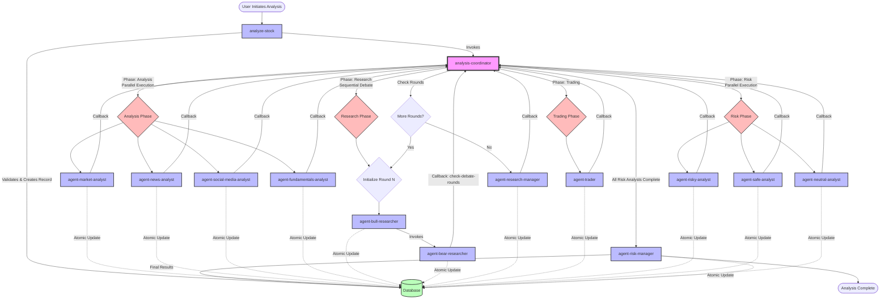
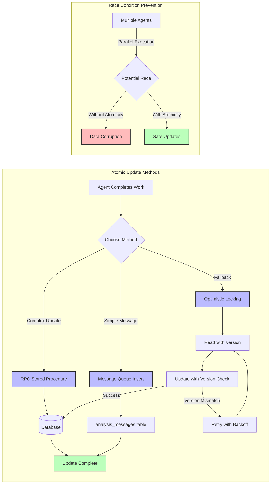

# CLAUDE.md

This file provides guidance to Claude Code (claude.ai/code) when working with code in this repository.

## Project Overview

This is a Supabase Edge Functions implementation of the TradingGoose multi-agent AI trading analysis system. It orchestrates 11 specialized AI agents through a structured workflow to analyze stocks and provide trading recommendations.

## Key Commands

```bash
# Deploy with access token (required for production)
SUPABASE_ACCESS_TOKEN="sbp_72e308dcfc7de7eb83f03ab8fbea9366e3ffe6d6" npx supabase functions deploy [function-name] --project-ref lnvjsqyvhczgxvygbqer

# Deploy all agent functions
for agent in agent-market-analyst agent-news-analyst agent-social-media-analyst agent-fundamentals-analyst agent-bull-researcher agent-bear-researcher agent-research-manager agent-trader agent-risky-analyst agent-safe-analyst agent-neutral-analyst agent-risk-manager analysis-coordinator analyze-stock; do
  SUPABASE_ACCESS_TOKEN="sbp_72e308dcfc7de7eb83f03ab8fbea9366e3ffe6d6" npx supabase functions deploy $agent --project-ref lnvjsqyvhczgxvygbqer
done

# View function logs
SUPABASE_ACCESS_TOKEN="sbp_72e308dcfc7de7eb83f03ab8fbea9366e3ffe6d6" npx supabase functions logs [function-name]

# Run functions locally
npx supabase functions serve

# Push database migrations
SUPABASE_ACCESS_TOKEN="sbp_72e308dcfc7de7eb83f03ab8fbea9366e3ffe6d6" npx supabase db push --project-ref lnvjsqyvhczgxvygbqer
```

## Architecture

### Workflow Diagram



### Entry Point
- `analyze-stock/index.ts`: Main entry point that validates input, fetches user settings, creates analysis record, and initiates the coordinator workflow

### Workflow Orchestration

The system uses a coordinator pattern where `analysis-coordinator` manages the entire workflow:

1. **Analysis Phase** (Parallel)
   - agent-market-analyst: Technical analysis with indicators
   - agent-news-analyst: Recent news impact assessment  
   - agent-social-media-analyst: Sentiment from social platforms
   - agent-fundamentals-analyst: Financial health evaluation

2. **Research Phase** (Sequential Debate)
   - Coordinator initializes debate round N
   - agent-bull-researcher: Presents bullish investment case
   - agent-bull-researcher invokes agent-bear-researcher when complete
   - agent-bear-researcher: Responds with bearish counterarguments
   - agent-bear-researcher calls coordinator with 'check-debate-rounds'
   - Coordinator checks if more rounds needed (configurable via `research_debate_rounds`)
   - If more rounds: restart with next round
   - If complete: agent-research-manager synthesizes final thesis

3. **Trading Phase**
   - agent-trader: Makes BUY/SELL/HOLD decision based on all inputs

4. **Risk Phase** (Parallel then Sequential)
   - agent-risky-analyst: Aggressive risk perspective
   - agent-safe-analyst: Conservative risk perspective
   - agent-neutral-analyst: Balanced risk perspective
   - agent-risk-manager: Final position sizing and risk parameters

### Shared Utilities

- `_shared/types.ts`: Common interfaces (`AgentRequest`) and helper functions (`getAnalysisDepth`, `getHistoryDays`, `getDebateRounds`)
- `_shared/aiProviders.ts`: Multi-provider AI integration (OpenAI, Anthropic, Google, OpenRouter, DeepSeek) with `callAIProvider` function
- `_shared/atomicUpdate.ts`: Database update utilities for race condition handling:
  - `appendAnalysisMessage`: Atomically append messages
  - `updateWorkflowStepStatus`: Update workflow UI state
  - `updateDebateRounds`: Handle research debate updates
  - `updateFinalAnalysisResults`: Complete the analysis
- `_shared/cancellationCheck.ts`: Analysis cancellation support with `checkAnalysisCancellation` and `markAnalysisAsCanceled`

### Key Patterns

1. **Fire-and-forget invocations**: Functions invoke other functions without awaiting to enable parallel execution
2. **Callback pattern**: Agents notify the coordinator on completion via the `agent` parameter in the request body
3. **CRITICAL - Atomic updates**: ALL database updates MUST use proper atomic methods to prevent race conditions:
   - **Primary method**: Use Supabase RPC stored procedures (`update_workflow_step_status`, `update_debate_round`)
   - **Fallback method**: Use optimistic locking with version/timestamp checking
   - **Message queue**: Use `analysis_messages` table for guaranteed atomic inserts
   - **NEVER**: Use simple read-then-write patterns without concurrency control
4. **Flexible AI providers**: Each user can configure their preferred AI provider and model
5. **Cancellation handling**: All agents check for cancellation status before proceeding with work

### Database Integration

Functions interact with these key tables:
- `analysis_history`: Stores complete analysis results and workflow state
  - `full_analysis` JSONB field contains messages, workflowSteps, debateRounds
  - `analysis_status`: 'pending'|'running'|'completed'|'error' (unified string-based status)
  - `is_canceled`: Boolean flag for user-initiated cancellation
- `api_settings`: User-specific API keys and configuration
- `analysis_messages`: Message queue for atomic message tracking (fallback for race conditions)

### API Settings Structure

```typescript
apiSettings: {
  // AI Provider Configuration
  ai_provider: string;              // 'openai' | 'anthropic' | 'google' | 'openrouter' | 'deepseek'
  ai_api_key: string;               // Extracted based on ai_provider from provider-specific columns
  ai_model?: string;                // Optional model override
  
  // Market Data
  finnhub_api_key: string;          // Required for market data
  
  // Analysis Customization
  analysis_depth?: string;          // 'minimal' | 'light' | 'standard' | 'detailed' | 'extensive'
  analysis_history_days?: number;   // Default: 30
  research_debate_rounds?: number;  // Default: 2
}
```

### Agent Communication Flow

1. User initiates analysis via `analyze-stock`
2. `analyze-stock` creates analysis record and invokes `analysis-coordinator` with phase='analysis'
3. Coordinator invokes agents for current phase:
   - **Analysis & Risk phases**: Parallel execution, each agent calls back to coordinator
   - **Research phase**: Sequential debate flow:
     - Coordinator → Bull Researcher
     - Bull Researcher → Bear Researcher (direct invocation)
     - Bear Researcher → Coordinator (callback with 'check-debate-rounds')
     - Coordinator checks rounds and either starts next round or moves to Research Manager
   - **Trading phase**: Single agent execution
4. Coordinator tracks completions and advances to next phase
5. Process continues until all phases complete

### Error Handling

- All functions use try-catch blocks with detailed error logging
- Failed analyses are marked with `analysis_status: 'error'`
- Atomic updates have retry logic with exponential backoff
- Database functions have optimistic locking fallbacks

### Database Update Best Practices

**CRITICAL**: All database updates in edge functions MUST be atomic to prevent race conditions from parallel agent execution.

#### Atomic Update Flow Diagram



#### Required Atomic Update Pattern:
```typescript
// ✅ CORRECT - Using RPC stored procedure
const { data, error } = await supabase.rpc('update_workflow_step_status', {
  p_analysis_id: analysisId,
  p_phase_id: phaseId,
  p_agent_name: agentName,
  p_status: status
});

// ✅ CORRECT - Using message queue for guaranteed atomicity
await supabase.from('analysis_messages').insert({
  analysis_id: analysisId,
  agent_name: agentName,
  message: message,
  message_type: messageType
});

// ❌ WRONG - Race-prone read-then-write
const { data } = await supabase.from('analysis_history').select('*').eq('id', id);
// DO NOT DO THIS - Another agent might update between read and write!
await supabase.from('analysis_history').update({ ...data, newField: value });
```

#### Atomic Update Methods (in order of preference):
1. **Supabase RPC functions**: Create stored procedures in the database for complex atomic operations
2. **Message queue pattern**: Insert into append-only tables that are processed later
3. **Optimistic locking**: Include version/timestamp checks in WHERE clause
4. **Row-level locks**: Use SELECT FOR UPDATE in transactions (requires RPC)

Always test concurrent updates during development by simulating multiple agents updating the same analysis.

## Important Notes

- All functions use Deno runtime (not Node.js)
- Environment variables are accessed via `Deno.env.get()`
- Each analysis runs with the user's own API keys (no shared keys)
- Functions must complete within Supabase's timeout limits (typically 25-30 seconds)
- The coordinator handles phase transitions and completion callbacks
- CORS headers are properly set for browser-based access
- All timestamps use ISO 8601 format (`new Date().toISOString()`)
- Debug logging is extensive - check Supabase logs for troubleshooting